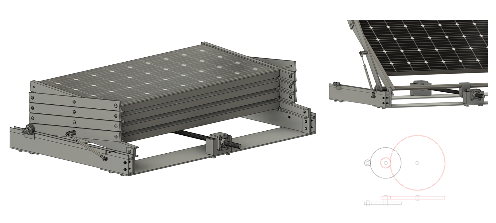
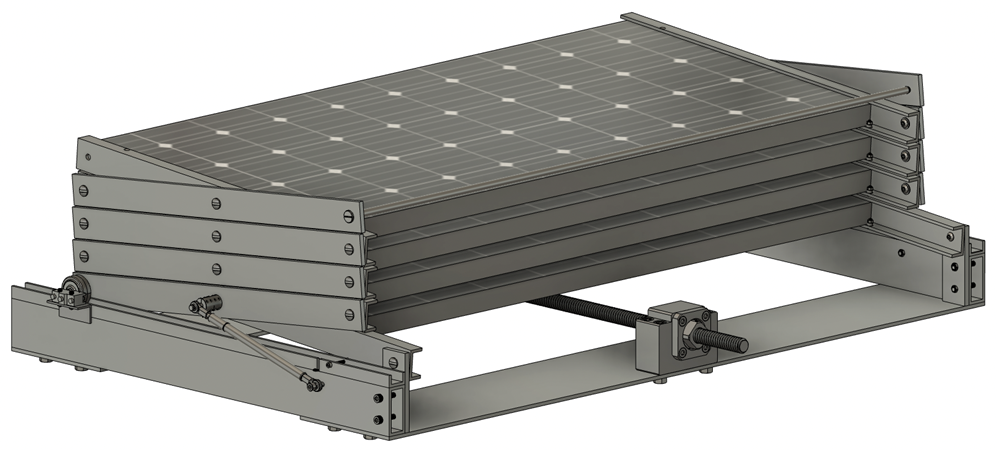
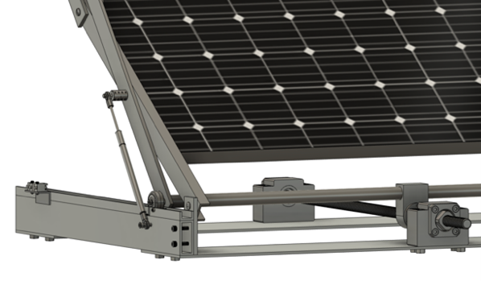
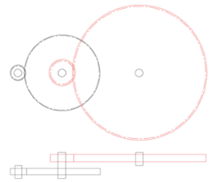
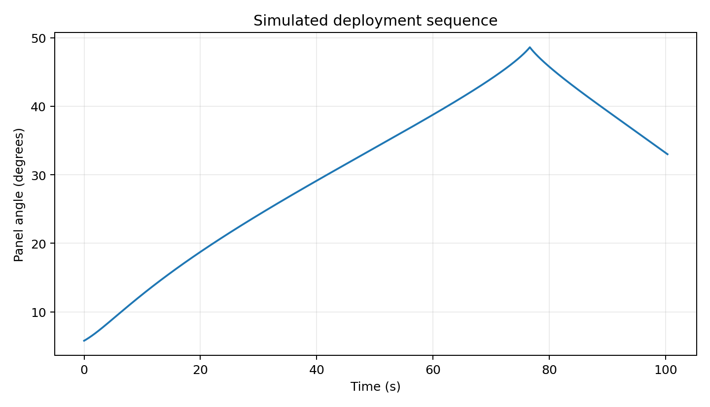
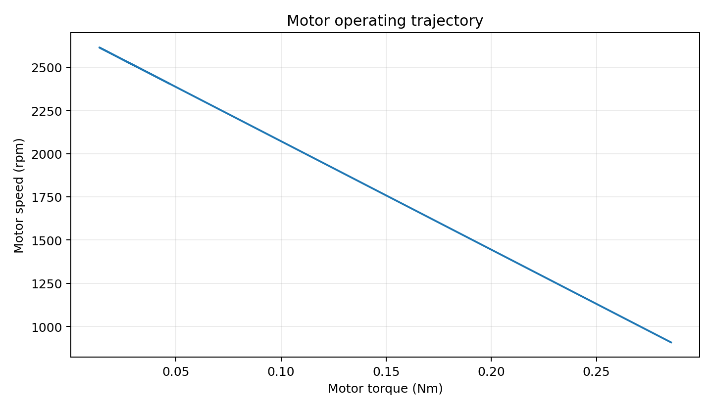

# Foldable Solar Panel Deployment System

<p align="center">
  
</p>

A mechanically actuated **foldable solar-panel deployment system** designed around a lead-screw drive, geared DC motor, linkage geometry, damping, and automated end-state control.

This project combines **mechanical design, nonlinear dynamics, numerical simulation, actuator sizing, energy analysis, gear-ratio selection, and embedded control**. The aim was not only to design a deployable mechanism, but to evaluate the drivetrain under gravity, damping, and wind loading before implementing the deployment sequence in hardware.

---

## Project scope

I developed the system across three connected layers:

1. **Mechanical design** — foldable panel geometry, linkage layout, lead-screw actuation, damping, and drivetrain packaging.
2. **Physics-based modelling and drivetrain sizing** — nonlinear equations of motion, wind and gravitational loading, lead-screw efficiency, motor torque-speed behaviour, deployment time, energy use, structural checks, and gear-ratio sweeps.
3. **Automation logic** — an Arduino finite-state controller that reads digital and analogue inputs and controls the deployment outputs according to system state and trigger conditions.

---

## Mechanical concept

<p align="center">
  
</p>

The mechanism stores multiple solar-panel sections in a compact stacked configuration. A geared motor drives a **lead screw**, translating the actuator block and forcing the linkage through its deployment trajectory. A damper is incorporated into the mechanism to control motion and reduce abrupt dynamic loading.

The numerical model uses the same mechanism-level quantities represented by the CAD design: panel dimensions, linkage lengths, pivot offset, deployment angles, damper geometry, and lead-screw drive parameters.

### Deployed configuration

<p align="center">
  
</p>

The supplied model represents the motion as a **two-phase deployment sequence**. The system starts at `Q1 = 5.8°`, passes a transition at `Q2 = 48.6°`, and finishes at `Q3 = 33°`. The equation-of-motion formulation changes after the transition to represent the mechanism after it passes its peak-angle configuration.

---

## Drivetrain and gearbox layout

<p align="center">
  
</p>

The drivetrain model includes the geared DC motor, lead screw, linkage transmission, and damping system. The code explicitly evaluates:

- motor stall torque and no-load speed;
- gearbox ratio;
- lead-screw lead, diameter, thread angle, and friction;
- lead-screw efficiency;
- torque-to-axial-force conversion;
- self-locking behaviour;
- lead-screw buckling load;
- critical screw speed.

For the selected configuration in the system-dynamics model:

| Parameter | Value |
|---|---:|
| Motor stall torque | 0.43 Nm |
| Motor no-load speed | 2700 rpm |
| Gear ratio | 30.58:1 |
| Lead | 5 mm |
| Lead-screw diameter | 24 mm |
| Thread angle | 15° |
| Thread friction coefficient | 0.14 |
| Damper coefficient | 240.3 Ns/m |
| Maximum modelled wind speed | 10 m/s |

---

## Physics-based deployment model

The full deployment model is implemented in:

`System Dynamics and Energy Usage of a Foldable Solar Panel System in Windy Conditions.py`

The mechanism state is integrated numerically using `scipy.integrate.solve_ivp`. Angular acceleration is obtained from the net moment acting on the mechanism:

**actuator torque − gravitational resistance − wind loading − damping effects**

The model updates the linkage geometry continuously during deployment, rather than assuming a fixed mechanical advantage.

### Geometry-dependent damping

The damper length is calculated from the instantaneous mechanism angle. Its rate of change is then used to obtain damping force, allowing the damping contribution to change with both configuration and velocity.

### Wind loading

Wind loading is represented as an angle-dependent resisting term. The actuator is therefore evaluated against an external load that changes as the panel orientation changes, rather than against gravity alone.

### Lead-screw force transmission

Motor torque is propagated through the gearbox and lead-screw model to obtain the usable axial force at the actuator. Thread geometry, friction, and calculated screw efficiency are included in this conversion.

---

## Simulated deployment

<p align="center">
  
</p>

Using the parameter set currently contained in the supplied script, the numerical model gives a deployment time of approximately **100.3 s**.

The same simulation evaluates:

- angular velocity;
- motor torque;
- motor speed;
- instantaneous power;
- current proxy;
- actuator and support loading;
- lead-screw buckling load;
- critical rotational speed;
- total deployment energy.

For the current parameter set, the model calculates total deployment energy of approximately **1395 J**.

---

## Motor operating trajectory

<p align="center">
  
</p>

The motor model uses a linear DC-motor torque-speed relationship derived from stall torque and no-load speed. Required holding torque is evaluated throughout the deployment trajectory and mapped to motor speed and power, so the drivetrain is assessed dynamically rather than only at a single worst-case static position.

---

## Motor and gear-ratio optimisation

`Motor Configuration and Gear Ratio Selector by Deployment Energy Optimisation.py`

extends the mechanism model into a **motor/gearbox design-space sweep**.

The script evaluates four candidate motor configurations over separate gear-ratio ranges. For every motor and ratio combination it:

1. calculates gearbox output torque;
2. converts output torque into lead-screw actuation force;
3. solves the nonlinear deployment dynamics;
4. records deployment time;
5. determines the required motor holding torque through the trajectory;
6. maps torque to speed and power;
7. integrates power over time to estimate deployment energy.

This turns motor selection into a **system-level trade-off between motor characteristics, gearing, deployment time, and energy use**, rather than a simple static torque check.

---

## Embedded automation

`Automation_Code.ino` implements the hardware-side deployment logic as a finite-state machine.

The controller reads five digital inputs on pins `0`, `1`, `2`, `5`, and `9`, together with two analogue inputs on `A1` and `A2`, and drives outputs on pins `3`, `4`, and `8`.

### State-machine logic

| State | Role | Behaviour |
|---|---|---|
| `0` | Idle | waits for one of two start inputs |
| `1` | Active after input `a` | monitors stop / limit conditions |
| `2` | Active after input `b` | monitors stop / limit conditions |
| `3` | Done | terminal state |

The code also applies analogue threshold logic alongside the discrete state transitions, allowing sensor-triggered behaviour to affect the deployment outputs.

---

## Engineering checks implemented

The scripts go beyond plotting the mechanism motion. They explicitly evaluate constraints that determine whether the concept is mechanically feasible:

- nonlinear deployment time;
- gravity-induced resisting torque;
- angle-dependent wind load;
- damper force;
- lead-screw friction and efficiency;
- available axial force;
- self-locking condition;
- motor torque-speed operation;
- power and deployment energy;
- support / wheel loading;
- Euler buckling load of the lead screw;
- critical lead-screw speed;
- motor and gear-ratio parameter sweeps.

---

## Repository structure

```text
.
├── README.md
├── Automation_Code.ino
├── Motor Configuration and Gear Ratio Selector by Deployment Energy Optimisation.py
├── System Dynamics and Energy Usage of a Foldable Solar Panel System in Windy Conditions.py
└── assets/
    ├── readme_banner.png
    ├── system_folded.png
    ├── system_deployed.png
    ├── gearbox_layout.png
    ├── deployment_angle.png
    └── motor_torque_speed.png
```

---

## Running the simulations

Install the Python dependencies:

```bash
pip install numpy scipy matplotlib
```

Then run either model:

```bash
python "System Dynamics and Energy Usage of a Foldable Solar Panel System in Windy Conditions.py"
```

```bash
python "Motor Configuration and Gear Ratio Selector by Deployment Energy Optimisation.py"
```

> **SciPy compatibility:** the supplied source uses `scipy.integrate.simps`. Newer SciPy versions use `scipy.integrate.simpson`, so that import/integration call may need a one-line update depending on your installed version.

---

## Skills demonstrated

**Mechanical engineering:** mechanism design, linkage kinematics, load analysis, damping, lead-screw design, actuator sizing  
**Dynamics:** nonlinear equations of motion, numerical integration, event-based simulation  
**Design optimisation:** motor/gear-ratio sweeps, deployment-time and energy comparison  
**Scientific computing:** Python, NumPy, SciPy, Matplotlib  
**Embedded systems:** Arduino/C++, digital and analogue I/O, finite-state control logic  
**CAD and system integration:** integrating mechanical layout, actuation, analysis, and control requirements

---

## Notes

The model parameters are currently defined directly in the scripts rather than through a configuration file or command-line interface, so the repository should be read as an **engineering analysis and prototype-control project**, not as a packaged software library.

The opening/closing behaviour can be investigated by changing the deployment-angle parameters. `Q1` represents the closed-system angle and `Q3` the final deployed angle; the equation-of-motion logic is structured around this sequence.
